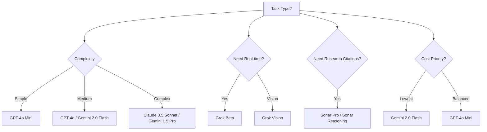

# AI Models Guide - Walter System

## 🤖 Available AI Providers & Models

Walter System now supports **5 AI providers** with **10 flagship models**. Each provider is limited to its two most capable, widely available options so testing stays focused.

---

## 📋 Quick Setup

Add these variables to `server/.env` (copy from `.env.example`):

```env
# OpenAI (core fallback)
OPENAI_API_KEY=sk-proj-...

# Anthropic Claude (reasoning specialist)
ANTHROPIC_API_KEY=sk-ant-...

# Google Gemini (long-context + free tier)
GOOGLE_API_KEY=AIza...

# xAI Grok (real-time news)
XAI_API_KEY=xai-...

# Perplexity AI (search + citations)
PERPLEXITY_API_KEY=pplx-...

# Optional: Brave Search (shared web search tool)
BRAVE_SEARCH_API_KEY=BSA...
```

---

## 🔑 How to Get API Keys

1. **OpenAI** – https://platform.openai.com/api-keys  
    Pay-as-you-go ($0.15–$10 per 1M tokens depending on tier). $5 free credit for new accounts.

2. **Anthropic Claude** – https://console.anthropic.com/  
    Pay-as-you-go ($0.80–$15 per 1M tokens). Outstanding for reasoning/coding tasks.

3. **Google Gemini** – https://makersuite.google.com/app/apikey  
    Free up to 15 requests/minute, then $0.075–$1.25 per 1M tokens. Great for multimodal + long context (2M tokens).

4. **xAI Grok** – https://console.x.ai/  
    Pay-as-you-go. Requires an X (Twitter) account. Best for real-time web knowledge.

5. **Perplexity AI** – https://www.perplexity.ai/settings/api  
    Pay-as-you-go. Designed for research answers with citations built-in.

---

## 🎯 Flagship Model Matrix

### Tier 1 · Premium Quality

| Model | Provider | Speed | Quality | Cost | Best For |
|-------|----------|-------|---------|------|----------|
| **Claude 3.5 Sonnet** | Anthropic | Fast | ⭐⭐⭐⭐⭐ | $$$ | Coding, deep reasoning, strategy |
| **GPT-4o** | OpenAI | Fast | ⭐⭐⭐⭐ | $$$ | Balanced generalist + multimodal |
| **Gemini 1.5 Pro** | Google | Medium | ⭐⭐⭐⭐ | $$ | 2M token context, long docs |
| **Sonar Pro** | Perplexity | Medium | ⭐⭐⭐⭐ | $$ | Research answers with citations |
| **Grok Beta** | xAI | Fast | ⭐⭐⭐ | $$ | Real-time news & current events |

### Tier 2 · Fast & Efficient

| Model | Provider | Speed | Quality | Cost | Best For |
|-------|----------|-------|---------|------|----------|
| **Claude 3.5 Haiku** | Anthropic | Very Fast | ⭐⭐⭐ | $ | Snappy chat + drafting |
| **GPT-4o Mini** | OpenAI | Very Fast | ⭐⭐⭐ | $ | High-volume assistants |
| **Gemini 2.0 Flash** | Google | Ultra Fast | ⭐⭐⭐⭐ | $ | Realtime multimodal + free tier |
| **Sonar Reasoning** | Perplexity | Fast | ⭐⭐⭐⭐ | $$ | Research + reasoning blend |
| **Grok Vision Beta** | xAI | Fast | ⭐⭐⭐ | $$ | Vision + news context |

---

## 💰 Token Cost Cheat Sheet (per 1M tokens)

| Model | Input | Output | Notes |
|-------|-------|--------|-------|
| GPT-4o | $2.50 | $10.00 | Premium Omni performance |
| GPT-4o Mini | $0.15 | $0.60 | Everyday assistant tier |
| Claude 3.5 Sonnet | $3.00 | $15.00 | Highest reasoning quality |
| Claude 3.5 Haiku | $0.80 | $4.00 | Fast + cost effective |
| Gemini 1.5 Pro | $1.25 | $5.00 | 2M token context |
| Gemini 2.0 Flash | $0.075 | $0.30 | Ultra fast + cheapest |
| Sonar Pro | $1.00 | $4.00 | Includes search + citations |
| Sonar Reasoning | $1.20 | $4.80 | Research + analysis |
| Grok Beta | ~$2.00 | ~$8.00 | Pricing varies (beta) |
| Grok Vision Beta | ~$2.50 | ~$9.00 | Early access pricing |

*(Pricing sourced November 2025; always verify in each console.)*

---

## 🚀 Recommended API Key Combos

### Local development (free/cheap)
```env
GOOGLE_API_KEY=...     # Gemini 2.0 Flash free tier
PERPLEXITY_API_KEY=... # Research preview
OPENAI_API_KEY=...     # Backup for edge cases
```

### Production (balanced quality)
```env
ANTHROPIC_API_KEY=...  # Primary (Claude 3.5 Sonnet)
OPENAI_API_KEY=...     # Backup (GPT-4o / Mini)
GOOGLE_API_KEY=...     # Long-context workflows
```

### Research / real-time mode
```env
PERPLEXITY_API_KEY=... # Citations + reasoning
XAI_API_KEY=...        # Real-time Grok answers
BRAVE_SEARCH_API_KEY=... # Enables shared web search tool
```

---

## 📊 Usage Tips

- **Claude 3.5 Sonnet** – best accuracy, code review, strategic analysis.
- **Claude 3.5 Haiku** – fastest Claude for chatbots + drafting.
- **GPT-4o** – balanced generalist (voice, vision, chat, code) with excellent tool use.
- **GPT-4o Mini** – budget workhorse for most day-to-day prompts.
- **Gemini 1.5 Pro** – when you need multi-million token context or native multimodal.
- **Gemini 2.0 Flash** – free, super fast responses ideal for prototyping.
- **Grok Beta** – trending topics, social media chatter, breaking news.
- **Grok Vision** – similar but with lightweight vision understanding.
- **Sonar Pro / Sonar Reasoning** – research mode with citations and focused reasoning.

---

## 🛠️ Testing Your Setup

After saving `server/.env`, restart the backend:

```bash
cd server
npm run server:dev
```

Expected console banner:
```
✓ OpenAI provider initialized
✓ Anthropic (Claude) provider initialized
✓ Google (Gemini) provider initialized
✓ xAI (Grok) provider initialized
✓ Perplexity AI provider initialized

🤖 AI Providers initialized: 5 providers, 10 models available
```

---

## 🔒 Security Reminders

1. Never commit `.env`.
2. Store keys in your secrets manager for production.
3. Set budget alerts in each provider dashboard.
4. Rotate compromised keys immediately.
5. Limit key scope/permissions when possible.

---

## 📈 Model Selection Flow



---

## 🆘 Troubleshooting

- **Provider missing** – double-check `.env`, restart server, confirm key is active.
- **Rate limited** – Gemini free tier caps at 15 req/min; consider spreading traffic across providers.
- **Unexpected costs** – prefer GPT-4o Mini or Gemini 2.0 Flash; stream responses to stop early.

---

## 📚 Additional Resources

- [OpenAI Documentation](https://platform.openai.com/docs)
- [Anthropic Claude Docs](https://docs.anthropic.com)
- [Google AI Studio](https://ai.google.dev)
- [xAI Grok Docs](https://docs.x.ai)
- [Perplexity API Docs](https://docs.perplexity.ai)

---

**Last Updated:** November 2025  
**Walter System Version:** 2.1 (Flagship Model Edition)
